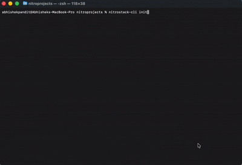
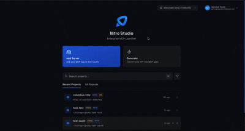
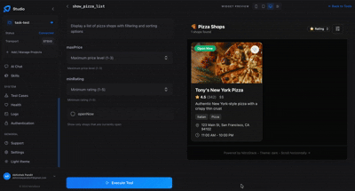
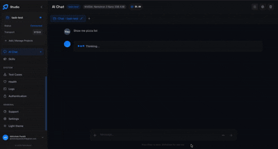

<div align="center">
  <a href="https://nitrostack.ai">
    
  </a>

  <h1>NitroStack</h1>

  <p><strong>The enterprise-grade TypeScript framework for building production-ready MCP servers.</strong></p>
  <p>Decorators. Dependency Injection. Widgets. One framework to ship AI-native backends.</p>

  <br />

  <a href="https://www.npmjs.com/package/@nitrostack/core"></a>
  <a href="https://www.npmjs.com/package/@nitrostack/core"></a>
  <a href="https://github.com/nitrocloudofficial/nitrostack"></a>
  <a href="https://opensource.org/licenses/Apache-2.0"></a>
  <a href="https://discord.gg/5fMj9FUA"></a>
  <a href="https://x.com/nitrostackai"></a>
  <a href="https://www.youtube.com/@nitrostackai"></a>
  <a href="https://linkedin.com/company/nitrostack-ai/"></a>
  <a href="https://github.com/nitrostackai"></a>

  <br />
  <br />

  <a href="https://docs.nitrostack.ai"><strong>Documentation</strong></a> &nbsp;&middot;&nbsp;
  <a href="https://docs.nitrostack.ai/quick-start"><strong>Quick Start</strong></a> &nbsp;&middot;&nbsp;
  <a href="https://blog.nitrostack.ai"><strong>Blog</strong></a> &nbsp;&middot;&nbsp;
  <a href="https://nitrostack.ai/studio"><strong>NitroStudio</strong></a> &nbsp;&middot;&nbsp;
  <a href="https://discord.gg/5fMj9FUA"><strong>Discord</strong></a>

  <br />
  <br />
</div>

---

## Quick Start

### Prerequisites

- **Node.js** >= 20.18 ([download](https://nodejs.org/))
- **npm** >= 9

### 1. Scaffold a new project

```bash
npx @nitrostack/cli init my-server
```



### 2. Start developing

```bash
cd my-server
npm install
npm run dev
```

Your MCP server is running. Connect it to any MCP-compatible client.

### 3. Open in NitroStudio

Once your project is scaffolded, open the same folder in NitroStudio for visual testing and debugging.

- Download: <https://nitrostack.ai/studio>
- Open your `my-server` project folder
- Use NitroStudio to test tools, inspect payloads, and chat with your MCP server

## Why NitroStack?

Building MCP servers today means stitching together boilerplate, reinventing authentication, and hoping your tooling scales. NitroStack gives you an opinionated, batteries-included framework so you can focus on what your server actually does.

- **Decorator-driven** — Define tools, resources, and prompts with clean, declarative TypeScript decorators
- **Dependency injection** — First-class DI container with singleton, transient, and scoped lifecycles
- **Auth built in** — JWT, OAuth 2.1, and API key authentication out of the box
- **Middleware pipeline** — Guards, interceptors, pipes, and exception filters just like enterprise backends
- **UI Widgets** — Attach React components to tool outputs for rich, interactive responses
- **Zod validation** — End-to-end type safety from schema to runtime
- **NitroStudio** — A dedicated desktop app for testing, debugging, and chatting with your server

## See It in Action

```typescript
import { McpApp, Module, ToolDecorator as Tool, z, ExecutionContext } from '@nitrostack/core';

@McpApp({
  module: AppModule,
  server: { name: 'my-server', version: '1.0.0' }
})
@Module({ imports: [] })
export class AppModule {}

export class SearchTools {
  @Tool({
    name: 'search_products',
    description: 'Search the product catalog',
    inputSchema: z.object({
      query: z.string().describe('Search query'),
      maxResults: z.number().default(10)
    })
  })
  @UseGuards(ApiKeyGuard)
  @Cache({ ttl: 300 })
  @Widget('product-grid')
  async search(input: { query: string; maxResults: number }, ctx: ExecutionContext) {
    ctx.logger.info('Searching products', { query: input.query });
    return this.productService.search(input.query, input.maxResults);
  }
}
```

One decorator stack gives you: **API definition + validation + auth + caching + UI** — zero boilerplate.

## Ecosystem

NitroStack is modular. Install only what you need:
The implementation workspace for NitroStack packages lives in [`typescript/`](./typescript).

| Package | What it does | Install |
|:---|:---|:---|
| [`@nitrostack/core`](./typescript/packages/core) | The framework — decorators, DI, server runtime | `npm i @nitrostack/core` |
| [`@nitrostack/cli`](./typescript/packages/cli) | Scaffolding, dev server, code generators | `npm i -g @nitrostack/cli` |
| [`@nitrostack/widgets`](./typescript/packages/widgets) | React SDK for interactive tool output UIs | `npm i @nitrostack/widgets` |

## NitroStudio

NitroStudio is a desktop app purpose-built for developing MCP servers. Open your project folder — it handles the dev server for you.



**[Download NitroStudio](https://nitrostack.ai/studio)**

<table>
<tr>
<td width="50%">

**Real-time tool testing**
Execute tools, inspect payloads, and debug request/response cycles.



</td>
<td width="50%">

**Built-in AI chat**
Talk to your MCP server through an integrated AI assistant.



</td>
</tr>
</table>

- **Widget preview** — Instantly visualize your interactive UI components
- **Hot reload** — Changes reflect in real time as you develop

## Documentation

| Resource | Description |
|:---|:---|
| [Getting Started](https://docs.nitrostack.ai/getting-started) | Installation, quick start, and first project |
| [Server Concepts](https://docs.nitrostack.ai/sdk/typescript/server-concepts) | Modules, DI, and architecture deep dive |
| [Tools Guide](https://docs.nitrostack.ai/sdk/typescript/tools-guide) | Defining tools, validation, annotations |
| [Widgets Guide](https://docs.nitrostack.ai/sdk/typescript/ui-widgets-guide) | Building interactive UI components |
| [Authentication](https://docs.nitrostack.ai/sdk/typescript/authentication-overview) | JWT, OAuth 2.1, API key setup |
| [CLI Reference](https://docs.nitrostack.ai/cli/introduction) | All CLI commands and options |
| [Deployment](https://docs.nitrostack.ai/deployment/checklist) | Production checklist, Docker, cloud platforms |

## Community

- [Discord](https://discord.gg/5fMj9FUA) — Ask questions, share projects, get help
- [GitHub Discussions](https://github.com/nitrocloudofficial/nitrostack/discussions) — Proposals, ideas, and Q&A
- [Twitter / X](https://x.com/nitrostackai) — Announcements and updates
- [YouTube](https://www.youtube.com/@nitrostackai) — Product demos and walkthroughs
- [LinkedIn](https://linkedin.com/company/nitrostack-ai/) — Company news and updates
- [GitHub](https://github.com/nitrostackai) — Organization profile and open-source work
- [Blog](https://blog.nitrostack.ai) — Tutorials, deep dives, and release notes

## Contributing

We welcome contributions of all kinds — bug fixes, features, docs, and ideas. Read the **[Contributing Guide](./CONTRIBUTING.md)** to get started.

Looking for a place to begin? Check out issues labeled [**good first issue**](https://github.com/nitrocloudofficial/nitrostack/labels/good%20first%20issue).

## Contributors

<a href="https://github.com/nitrocloudofficial/nitrostack/graphs/contributors">
  
</a>

## License

NitroStack is open-source software licensed under the [Apache License 2.0](./LICENSE).

---

<div align="center">
  <sub>Built by the <a href="https://nitrostack.ai">NitroStack</a> team and contributors.</sub>
</div>
